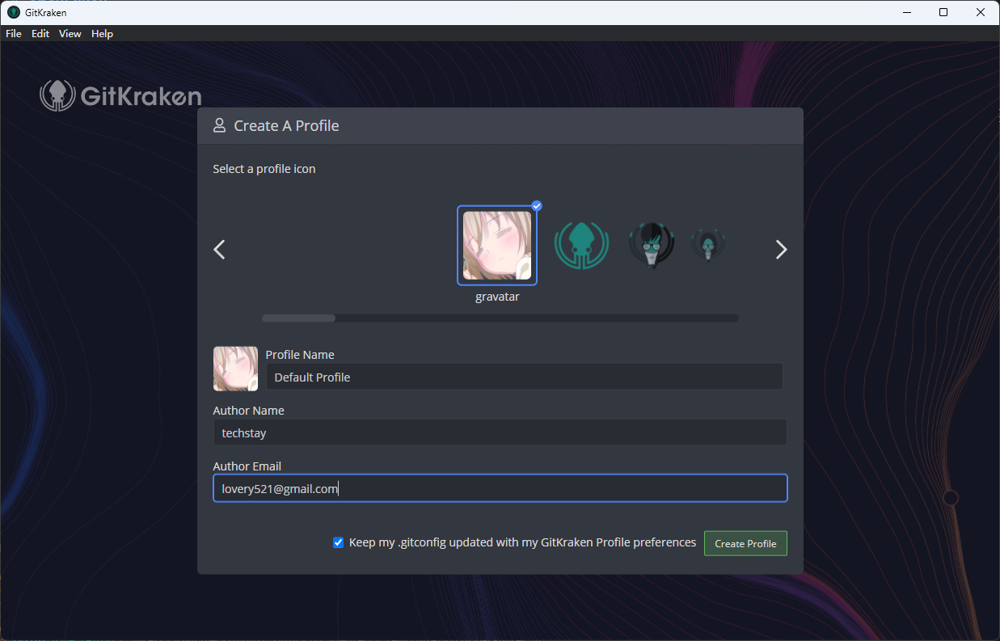

# Gitkraken

Gitkraken 是一个跨平台的 git 图形界面客户端，支持 Windows、Linux 等多种系统。个人可以在本地和公共仓库上免费使用 Gitkraken。

## 下载安装

从[这个链接](https://www.gitkraken.com/invite/8FE2Ze9S)可以注册一个 Gitkraken 账户，然后从[这里](https://www.gitkraken.com/download)可以下载和安装 Gitkraken。

初次使用需要先登录刚刚注册的 Gitkraken 账户，然后配置使用 git 所需的用户名和电子邮件。如果你之前没有使用过 git，可以选中下面的对勾，这样会将用户名和电子邮件的配置写入本地配置文件，之后命令行工具或者其他 git 软件也可以读取这个配置了。

TODO: 补充 Gitkraken 其他界面和功能使用
